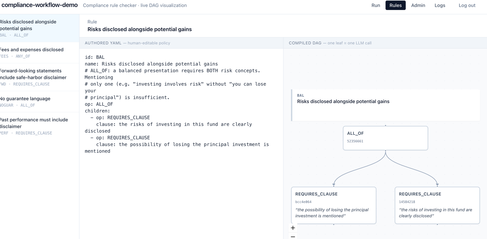
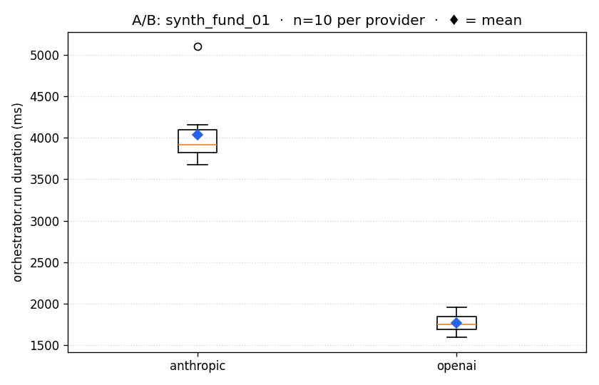
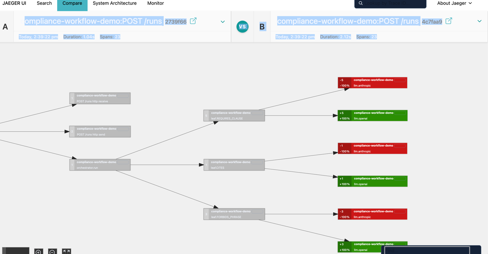

# compliance-workflow-demo

Compiles lawyer-written compliance rules (YAML) into a DAG of atomic LLM checks, runs them against SEC prospectuses, and reports pass / fail / degraded per rule. Retries and Anthropic → OpenAI failover live underneath; OpenTelemetry spans run from the HTTP handler down to each LLM call.


## Why this shape

A compliance rule isn't really one yes/no question — it's usually three or four ("past performance disclaimer present *AND* no unqualified guarantees *AND* balanced risk treatment"). Asking an LLM the whole thing at once gives you a confident paragraph with no auditable verdict. So the pipeline does it the other way: the rule is a DSL, the compiler expands it into a DAG of **atomic** LLM checks (each a single boolean question + evidence quote), and aggregators combine those leaves. Shared sub-expressions across rules collapse into one content-addressed node, so a leaf used by N rules runs once.



LLMs are unreliable in a second dimension: the providers themselves. Every atomic check goes through a router with exponential-backoff retries on each provider and Anthropic → OpenAI failover — so a single 529 doesn't fail the run, and once retries exhaust the next provider takes over.

## Quick start

```bash
# Prereqs: uv, docker, node 20+, Anthropic and/or OpenAI API keys in .env
./scripts/dev.sh
```

That brings up:

- **App**       — http://localhost:5173  (Run / Rules / Admin tabs)
- **API docs**  — http://localhost:8765/api-docs
- **Jaeger**    — http://localhost:16686

Pick a document in the Run tab, click **Check all rules**, watch the DAG light up as leaves execute in parallel and aggregators fold results upward. Every run produces a full trace in Jaeger (HTTP → orchestrator → per-leaf → per-LLM-call) and a row in Postgres.

## A/B provider comparison

The script `scripts/ab-bench.py` fires N runs against each provider, reads the `orchestrator.run` span durations back from Jaeger's API, and produces a stats table plus a box-plot PNG:

```bash
uv run scripts/ab-bench.py --n 10
```



For visual side-by-side of single traces, `./scripts/ab-compare.sh` posts two runs and prints a ready-to-click Jaeger Compare URL:



## Layout

```
src/compliance_workflow_demo/
  dsl/        rule schema + compiler (content-addressed node IDs)
  router/     provider adapters, retry, failover
  executor/   atomic check + orchestrator (fans out via asyncio.gather)
  ingest/     PDF chunking with page-stamped DocChunks
  db/         psycopg-3 persistence (runs, findings, router_calls)
  api/        FastAPI endpoints (REST + SSE) + OTel wiring
  obs/        OpenTelemetry tracing setup
rules/        FINRA 2210 rule YAMLs (5 of them)
corpus/       6 synthetic fund one-pagers + 1 real SEC prospectus
migrations/   numbered SQL migrations (applied on API startup)
scripts/      demo_run, ab-bench, ab-compare, otel_smoke, verify_matrix
  outputs/    generated artifacts (A/B charts, screenshots)
frontend/     Vite + React + TS; Run / Rules / Admin views
infra/        docker-compose: postgres + jaeger
tests/        pytest — 127 tests, hits Postgres + real DSL
```

## Points of interest

- `src/compliance_workflow_demo/dsl/graph.py` — content-addressed node ID (sha256 of `{op, params, sorted(child_ids)}`) is what unlocks DAG sharing + cross-run caching.
- `src/compliance_workflow_demo/router/router.py` — the failover→retry nesting; PermanentError skips both layers.
- `src/compliance_workflow_demo/executor/check.py` — `_resolve_page` + the FORBIDS_PHRASE hallucination guard. Page refs come from the chunker, never from the LLM.
- `scripts/ab-bench.py` — pulls per-run `orchestrator.run` durations from Jaeger's HTTP API and prints a stats table per provider.

See [`DESIGN.md`](DESIGN.md) for the rationale and what was deliberately left out.
